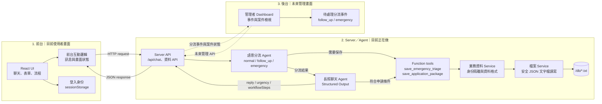

# 系統架構草圖

本專案的「後台」是未來給管理者使用的管理畫面；目前的 server 主要就是 Agent 執行服務。資料 Service 與檔案 Service 因此放在 Server／Agent 區塊，不放在未來的後台畫面。

## 三個區塊的責任

### 1. 前台（目前使用者畫面）

- 使用者操作 React 畫面、聊天、表單與申請流程。
- 透過 HTTP 呼叫 Server，不直接接觸檔案系統或 OpenAI API Key。
- 目前登入身份暫存在 `sessionStorage`。

### 2. Server／Agent（目前正在做）

- Server 接收前台訊息，負責驗證、執行 Agent 與回傳結果。
- Agent 先做語意分流，再產生長照回覆。
- Function tool 由 server 執行；Agent 不直接讀寫 `/db`。
- 業務資料 Service 與檔案 Service 負責身份隔離及 `/db/*.txt` 讀寫。

### 3. 後台（未來管理畫面）

- 提供管理者檢視 `follow_up`、`emergency` 分流事件與案件狀態。
- 透過未來的管理 API 取得資料，不直接讀取 `/db`。
- 可再依需求增加事件處理、備註或通報狀態。

## 一次聊天的資料流

1. 使用者在前台送出訊息。
2. Server／Agent 先判斷分流等級。
3. `follow_up` 或 `emergency` 由 function tool 保存分流事件。
4. 長照聊天 Agent 產生結構化回覆。
5. 符合申請條件時，function tool 保存申請大禮包。
6. Server 將結果回傳前台；未來後台再透過管理 API 檢視事件。
